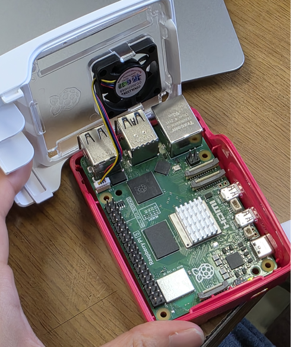
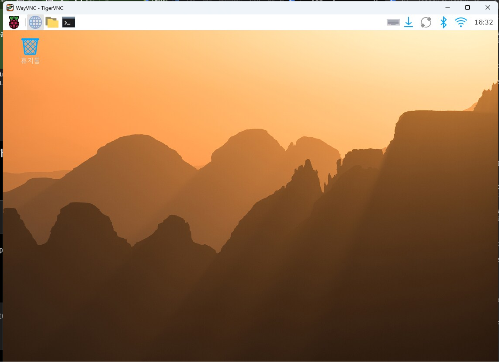
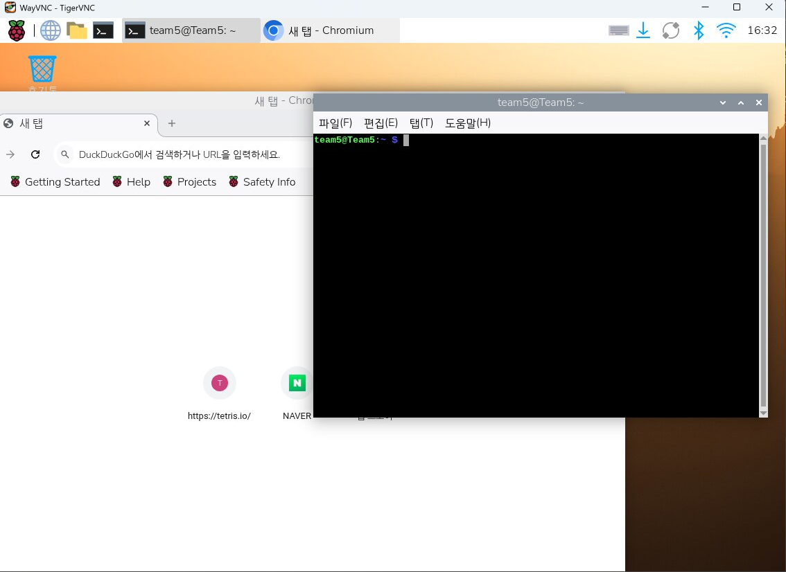
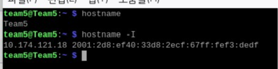
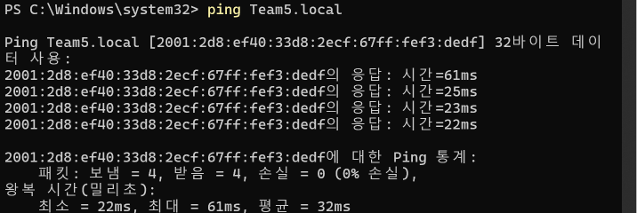

# Week 02 - Raspberry Pi 5 기본 설정 및 원격 연결

## 1. 수업 개요

2주차에는 Raspberry Pi 5의 기본 구조와 주요 인터페이스를 확인하고,
microSD 카드에 Raspberry Pi OS를 설치하여 사용할 수 있도록 기본 환경을 구성했다.

또한 Raspberry Pi를 모니터에 직접 연결하는 방식뿐만 아니라
네트워크를 이용해 다른 PC에서 원격으로 화면을 확인하고 제어하는 방법도 실습했다.

### 이번 주 핵심 내용

- Raspberry Pi 5의 특징과 주요 포트 확인
- GPIO, USB, Ethernet, micro-HDMI 구조 확인
- 방열판 및 팬/케이스 구성
- Raspberry Pi Imager를 이용한 Raspberry Pi OS 설치
- Hostname, 사용자 계정, Wi-Fi, 지역 설정
- Raspberry Pi OS 부팅
- VNC를 이용한 원격 화면 연결
- 터미널에서 Hostname과 IP 주소 확인
- Windows PowerShell에서 `ping`으로 네트워크 연결 확인

---

## 2. Raspberry Pi란?

Raspberry Pi는 소형 단일 보드 컴퓨터(SBC)이다.

Arduino처럼 외부 장치를 제어하는 용도로 사용할 수 있으면서도
Linux 운영체제를 직접 실행할 수 있기 때문에 일반적인 소형 PC와 비슷하게 사용할 수 있다.

수업에서는 이후 Raspberry Pi를 이용해 Linux 기본 사용법,
GPIO 제어, 센서 및 외부 장치 연결, 네트워크 통신 등을 실습할 예정이다.

---

## 3. Raspberry Pi 5 주요 특징

수업에서는 Raspberry Pi 5를 사용했다.

| 항목 | 내용 |
|---|---|
| CPU | ARM Cortex-A76 계열 |
| 동작 속도 | 2.4 GHz |
| 저장장치 | microSD 카드 |
| 영상 출력 | micro-HDMI |
| 네트워크 | Ethernet / Wi-Fi |
| USB | USB 2.0 / USB 3.0 |
| GPIO | 40-pin GPIO Header |
| 기타 | UART, 카메라 인터페이스, 팬 커넥터 등 |

Raspberry Pi 5는 크기는 작지만 Linux 운영체제를 실행할 수 있고,
GPIO를 통해 LED, 센서, 모터 등의 외부 장치도 제어할 수 있다.

---

## 4. Raspberry Pi OS 설치 준비

Raspberry Pi를 사용하기 위해서는 microSD 카드에 운영체제를 설치해야 한다.

### 준비물

- Raspberry Pi 5
- microSD 카드
- microSD 카드 리더기
- Raspberry Pi Imager
- 전원 어댑터
- 키보드 / 마우스
- micro-HDMI 케이블 및 모니터

---

## 5. Raspberry Pi Imager

PC에서 Raspberry Pi Imager를 설치하고,
Raspberry Pi에서 사용할 운영체제를 microSD 카드에 기록했다.

진행 순서는 다음과 같다.

```text
Device 선택
    ↓
Operating System 선택
    ↓
Storage 선택
    ↓
초기 설정
    ↓
microSD 카드에 기록
```

### 📷 1번 캡처 - Raspberry Pi Imager

교재에 있는 Raspberry Pi Imager 화면을 추후 추가할 예정이다.

예정 파일명:

```text
week02_01_raspberrypi_imager.png
```

추후 이미지 추가 위치:

```markdown

```

---

## 6. Raspberry Pi 초기 설정

운영체제를 기록하기 전에 Raspberry Pi에서 사용할 기본 정보를 설정했다.

주요 설정 항목은 다음과 같다.

- Hostname
- 사용자 이름
- 비밀번호
- Wi-Fi
- 국가 / 지역
- 시간대
- 키보드 / 언어

여러 대의 Raspberry Pi를 같은 네트워크에서 사용하는 경우,
장치를 구분하기 위해 팀별로 다른 Hostname을 설정하는 것이 좋다.

> 비밀번호나 Wi-Fi 비밀번호는 GitHub에 공개하지 않는다.

### 📷 2번 캡처 - OS 초기 설정

교재에 있는 초기 설정 화면을 추후 추가할 예정이다.

예정 파일명:

```text
week02_02_os_customisation.png
```

추후 이미지 추가 위치:

```markdown

```

---

## 7. Raspberry Pi 5 실제 하드웨어

수업에서 Raspberry Pi 5 보드의 실제 구성을 확인했다.

주요 확인 부분:

- GPIO Header
- USB 포트
- Ethernet 포트
- micro-HDMI 포트
- CPU 및 주요 칩
- 방열판
- 팬
- 케이스

Raspberry Pi 5는 동작 중 발열이 발생하기 때문에
방열판과 팬을 이용해 냉각하는 것이 중요하다.

### 📷 4번 캡처 - Raspberry Pi 5 하드웨어



파일명:

```text
week02_04_raspberrypi5_hardware.png
```

---

## 8. Raspberry Pi 부팅 및 VNC 원격 연결

microSD 카드에 Raspberry Pi OS 설치를 완료한 후 Raspberry Pi를 부팅했다.

수업 환경에서는 micro-HDMI 케이블과 모니터가 충분하지 않았기 때문에
네트워크를 이용해 Raspberry Pi 화면에 원격으로 접속하는 방법도 사용했다.

구성은 다음과 같다.

```text
Raspberry Pi 5
      │
    Wi-Fi
      │
Windows PC
      │
     VNC
```

VNC 연결에 성공하면 Windows PC에서
Raspberry Pi의 바탕화면 전체를 확인하고 조작할 수 있다.

### 📷 3번 캡처 - VNC 원격 연결 성공



파일명:

```text
week02_03_vnc_desktop.png
```

---

## 9. VNC 환경에서 Raspberry Pi 사용

VNC로 연결한 뒤 Raspberry Pi에서 브라우저와 터미널을 실행했다.

원격 연결 상태에서도 Raspberry Pi를 직접 모니터에 연결한 것과 비슷하게
GUI 프로그램과 터미널을 사용할 수 있다.

### 📷 5번 캡처 - VNC에서 터미널 실행



파일명:

```text
week02_05_vnc_terminal.png
```

---

## 10. Hostname 및 IP 주소 확인

Raspberry Pi 터미널에서 현재 설정된 Hostname을 확인했다.

사용한 명령어:

```bash
hostname
```

실습 결과:

```text
Team5
```

다음으로 Raspberry Pi에 할당된 IP 주소를 확인했다.

```bash
hostname -I
```

이 명령을 이용하면 Raspberry Pi가 현재 네트워크에서 사용 중인
IPv4 및 IPv6 주소를 확인할 수 있다.

### 📷 6번 캡처 - Hostname / IP 주소 확인



파일명:

```text
week02_06_network_info.png
```

> IP 주소는 네트워크 환경에 따라 변경될 수 있다.

---

## 11. Windows에서 Raspberry Pi 연결 확인

Raspberry Pi와 Windows PC가 같은 네트워크에서 통신 가능한지 확인하기 위해
PowerShell에서 `ping` 명령을 사용했다.

Raspberry Pi의 Hostname이 `Team5`이므로 다음과 같이 실행했다.

```powershell
ping Team5.local
```

실습에서는 `Team5.local`이 정상적으로 인식되었으며
4개의 패킷을 보내 4개 모두 응답을 받아 연결을 확인했다.

### 📷 7번 캡처 - ping 연결 성공



파일명:

```text
week02_07_ping_success.png
```

이 결과를 통해 Windows PC와 Raspberry Pi가
네트워크를 통해 정상적으로 통신하고 있음을 확인할 수 있었다.

---

## 12. 수업 중 확인한 문제점

### micro-HDMI 케이블 부족

Raspberry Pi 5는 일반 HDMI가 아닌 micro-HDMI를 사용한다.

수업 당시 사용할 수 있는 케이블이 충분하지 않아
각 팀이 동시에 모니터를 연결하기 어려웠다.

### 모니터 입력 단자 차이

모니터에 따라 HDMI가 아닌 DP 입력을 사용하는 경우가 있어
추가 변환 케이블이 필요했다.

### microSD 카드 인식

microSD 카드와 카드 리더기는 삽입 방향이 정해져 있으므로
억지로 넣지 않고 방향과 연결 상태를 확인해야 한다.

### 네트워크 연결

원격 접속을 사용하려면 Raspberry Pi와 접속할 PC가
같은 네트워크에서 서로 통신할 수 있어야 한다.

### 한글 / Locale

초기 설정 후 한글이 정상적으로 표시되지 않는 경우
Locale, UTF-8, 국가 및 시간대 설정을 확인할 필요가 있다.

---

## 13. 이번 주 실습 흐름

```text
Raspberry Pi 5 구조 확인
        ↓
Raspberry Pi Imager 설치
        ↓
Raspberry Pi OS 선택
        ↓
microSD 카드에 OS 기록
        ↓
Hostname / 사용자 / Wi-Fi 설정
        ↓
Raspberry Pi 부팅
        ↓
VNC 원격 연결
        ↓
Raspberry Pi 화면 확인
        ↓
터미널 실행
        ↓
hostname / hostname -I 확인
        ↓
Windows에서 ping Team5.local 실행
        ↓
네트워크 통신 확인
```

---

## 14. 2주차 정리

이번 실습을 통해 Raspberry Pi 5의 기본 하드웨어 구조를 확인하고,
microSD 카드에 Raspberry Pi OS를 설치하여 실제로 부팅하는 과정을 진행했다.

또한 Raspberry Pi를 모니터에 직접 연결하는 방법 외에도
VNC를 이용하면 네트워크를 통해 다른 PC에서 Raspberry Pi 화면을
확인하고 조작할 수 있다는 것을 확인했다.

마지막으로 Raspberry Pi 터미널의 `hostname`, `hostname -I` 명령과
Windows PowerShell의 `ping Team5.local` 명령을 이용하여
장치 이름, IP 주소 및 네트워크 통신 상태를 직접 확인했다.

---

## 15. 이미지 파일 정리

```text
images/
└── week02/
    ├── week02_01_raspberrypi_imager.png       # 추후 교재 이미지 추가
    ├── week02_02_os_customisation.png         # 추후 교재 이미지 추가
    ├── week02_03_vnc_desktop.png
    ├── week02_04_raspberrypi5_hardware.png
    ├── week02_05_vnc_terminal.png
    ├── week02_06_network_info.png
    └── week02_07_ping_success.png
```

현재 3번부터 7번까지의 이미지는 정리 완료했다.
1번과 2번은 교재 캡처를 준비한 뒤 같은 폴더에 추가하면 된다.
